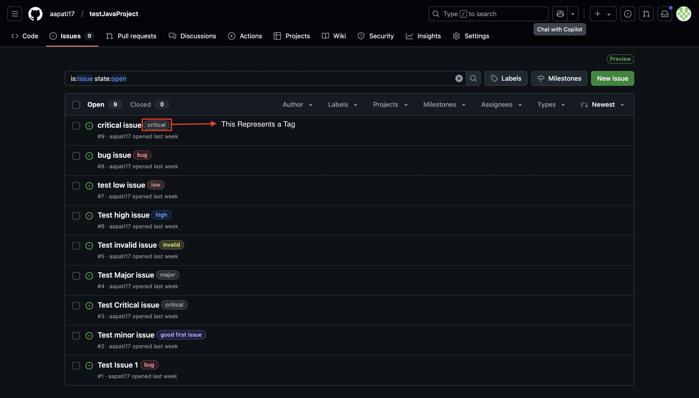

# SER 516 Group-Python-4
## Software Quality Metrics Calculator

### Table of Contents
1. [Introduction](#introduction)
2. [Project Overview](#project-overview)
3. [Fixes](#fixes)
4. [Setting up and Running the Project](#setting-up-and-running-the-project)
5. [How to use the Web-App](#how-to-use-the-web-app)
6. [Bugs (as of Period-1-release)](#bugs-as-of-period-1-release)
7. [Contributors](#contributors)

---

### Introduction 

Welcome to the documentation for the SER 516 Group_Python_4 project - Software Quality Metrics Calculator. This project is aimed at computing and retaining those computations of Software Quality Metrics *(in this case, LCOM4, LCOMHS and Defect score)* for any GitHub Public Repository that has Java code. This tool can help user to maintain software quality for projects at all scale.

___

### Project Overview 

The Software Quality Metrics Calculator is a two-part project:

- **Frontend:** A Vue-based web application that serves as the user interface for the Metrics Calculator. It provides an interactive environment for users to provide details about the GitHub repository and the metrics they want to calculate, and display the calculated metrics with all the previous data. 

- **Backend:** A Python application built using FastAPI for communication between Frontend and Backend, and Firebase for retaining the computed data. It contains the core logic for computing, routing and storing the results of computations.

___

### Fixes

- Readme and Documentation revised to explain the usage and prerequisites of the project.
- Defect Tags and Weights are made easier to customize and explanation is added.
- The services no longer bring 500 error code in the terminal.
---

### Setting up and Running the Project

Before we start setting up the project, we would need the following:
- Docker Desktop / Hub
- A public GitHub repository for which you want to measure metrics
- An existing FireBase Project and its serviceAccountKey.json (Click [here](https://arizonastateu-my.sharepoint.com/:v:/g/personal/aapati17_sundevils_asu_edu/EeWlv-MwbWRGuI7MoUIg_S8BB5QoxINDK-MLAbTtZ7Loqw?nav=eyJyZWZlcnJhbEluZm8iOnsicmVmZXJyYWxBcHAiOiJPbmVEcml2ZUZvckJ1c2luZXNzIiwicmVmZXJyYWxBcHBQbGF0Zm9ybSI6IldlYiIsInJlZmVycmFsTW9kZSI6InZpZXciLCJyZWZlcnJhbFZpZXciOiJNeUZpbGVzTGlua0NvcHkifX0&e=DIdogA) for video guide)


To run the project, follow these steps:
   - Go to the Terminal and redirect to the root directory of this project.
   - Run this Docker command to build the application:
     ```
     docker-compose up --build
     ```
   - Once built, you can open a web browser and go to the URL below:
     ```
     http://localhost:5173
     ```

___

### How to use the Web-App

Once the URL is loaded, you would be greeted with the landing page shown below:


Now, to compute your metrics, you have to follow 4 steps:

- [Validate your GitHub URL](#validate-your-github-url)
- [Select one or more metrics to calculate](#select-one-or-more-metrics-to-calculate)
- [Set the benchmark scores for the selected metrics](#set-the-benchmark-scores-for-the-selected-metrics)
- [Submit the data](#submit-the-data)
#### Validate your GitHub URL
- Copy and Paste your GitHub repository URL into the textbox

- There are two ways to validate your input, either by pressing `return` key or by clicking on the **Validate your URL** button below the textbox highlighted above.

#### Do's and Don'ts:

Do's:
- Please use the URL of GitHub repository which is **Public** and contains some **Java** code (be it a singular class or a full maven or gradle project).


Don'ts:
- Do not use the URL of a **Private** GitHub repository.


This repository has URL: https://github.com/agarasia/ser515


**Reason:** The GitHub REST API would return a `404` error

- Do not use the URL of a GitHub repository (be it Public OR Private) that does **NOT** contain Java code.


Note that unless and until you see the message `Valid GitHub repository`, the options for metrics are visible. However, they are *NOT CLICKABLE*.


#### Select one or more metrics to calculate:
Now that you have a valid GitHub URL and it is validated, you would now see that the checkboxes for metrics are clickable.


You can click on one or more metrics (say for instance, you want to calculate LCOM4 and Defect Score) simply by clicking on the corresponding checkboxes.


**Additional Instructions for Defect Score Calculation**

When you select the **Defect Score** checkbox, the app will prompt you to input the Tags and their respective weights. This step is necessary because GitHub issues do not have built-in support to determine the severity of reported issues automatically. Instead, the app relies on your input to assign weights to the tags, which in turn are used to calculate the defect severity.


##### Tags

- **Purpose:**
The tags you enter correspond directly to the labels you assign to issues on GitHub.

- **Example:**
For instance, if you label an issue as "bug", you should input the tag **bug** here.

- **Visual Guide:**


##### Weight

- **Definition:**
The weight is a numerical value that represents the severity of the tag.

- **Usage:**
A tag like **bug** might have a weight of **1**, whereas a **critical** tag could have a higher weight, such as **5**.

- **Impact:**
These weights are used by the app to calculate a weighted defect score, allowing you to assess both the quantity and severity of issues.

#### How to Use in the App

**Input Tags & Weights:** When prompted, enter the relevant GitHub issue tags along with their corresponding weights as illustrated below. Then, Click **+ Add Tag** button. 


Your custom defect tag would now be displayed below the **+ Add Tag** button.


#### Set the benchmark scores for the selected metrics

You would observe that upon clicking on any of the metric(s), there are additional details that you need to provide. These are the benchmark scores that you need to set before you send the data for computation and display.


Type in any benchmark score you would want to compare your actual results against.

#### Submit the data
Now, just click on **Submit** button.


The Computation can take longer depending on the number of Java files as well as their sizes. DO NOT click on Submit multiple times.
<br>

Once the computation is done, the results would be shown for the metrics within 2 graphs. One for the LCOM metrics (LCOM4 and LCOMHS), and other for the Defect Score.


Since LCOM4 and LCOMHS are computed for each class, there is an option to select which class do you want to observe using the dropdown.


For defect score, a number of values are illustrated; which are:
- Total number of Defects
- Weighted Average Density of Defects
- Maximum and Minimum Severity of the Defects
- Standard Deviation Density of the Weighted Average Density

You can hover over data points to see detailed timestamps and score values. The last data point is highlighted with a different color and larger radius, so you know it represents the most recent score.
___

### Bugs (as of Period-1-release)

- The Submit Button does not spawn a loading animation to indicate that the data is sent to the services and computation is in progress.
- The Benchmarks are forced in this release.
- If the metrics are being calculated for the first time, the graph shown is empty.
- If the metrics are being calculated again for the same valid GitHub repository, the benchmark scores that are already retained are not extracted successfully.

These bugs would be improved upon in future releases.

### Contributors

This project is a collaborative effort by the SER 516 Group-Python-4 team. If you have any questions or need assistance, please reach out to one of the team members-
- Aniket Patil (@aapati17)
- Aum Jitendra Garasia (@agarasia)
- Satyam Shekhar (@sshekh30)
- Uma Maheshwar Reddy N (@unallami)

---
